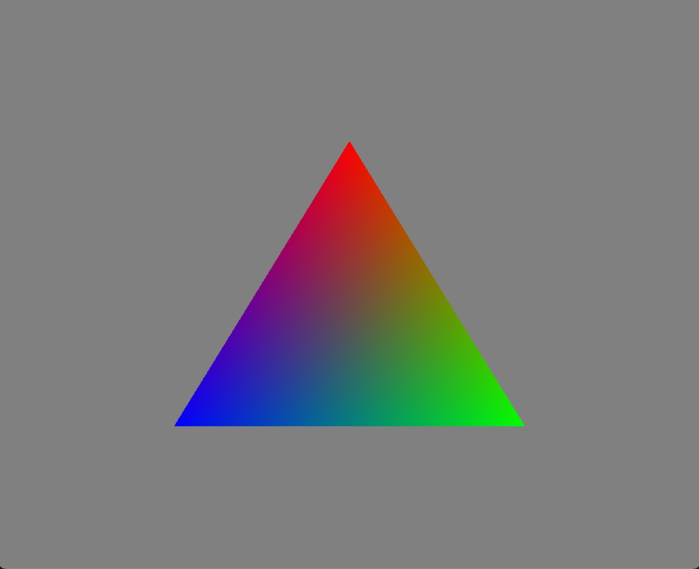
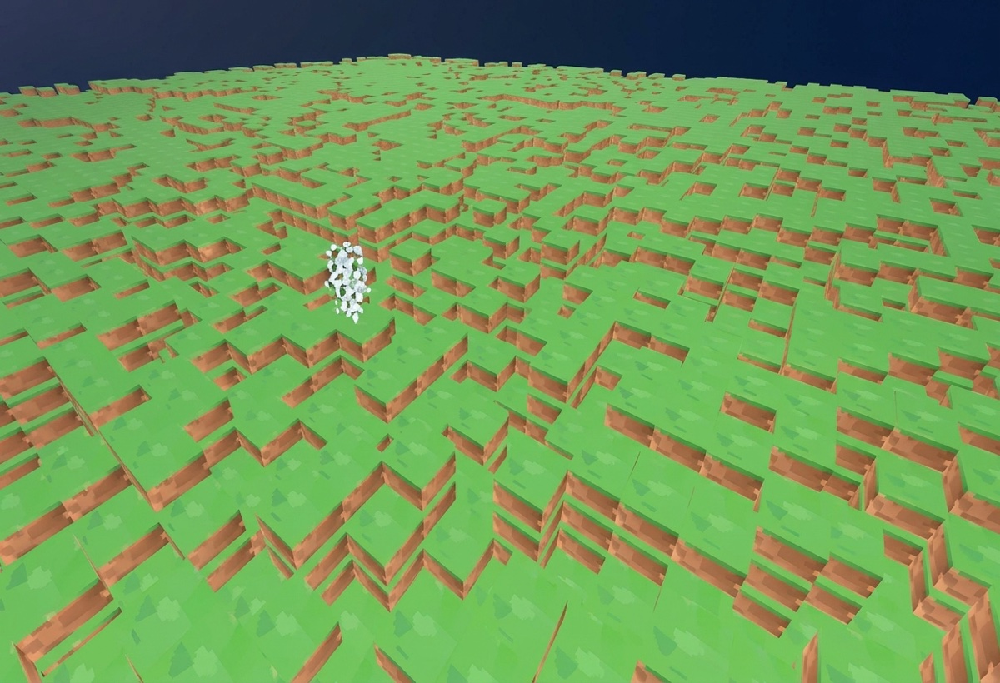
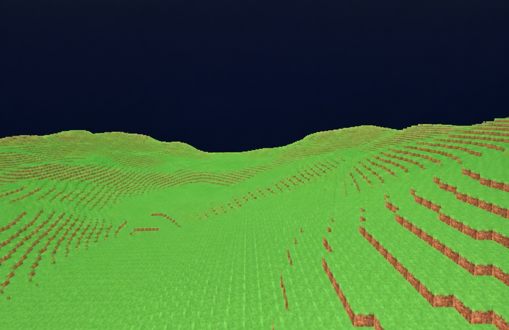
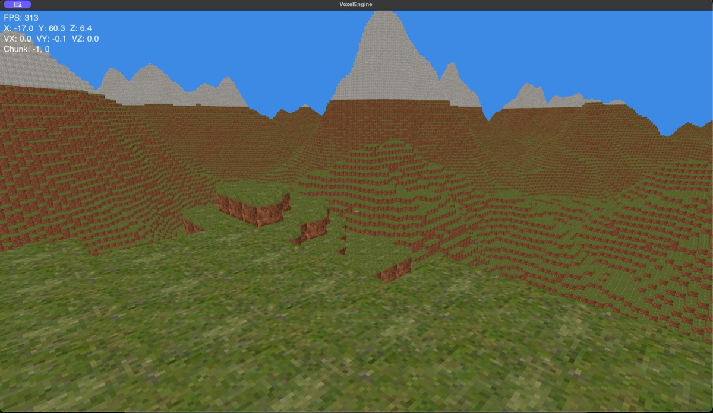

# VoxelEngine

A Minecraft-style voxel engine written from scratch in **Java** with **LWJGL 3** and **OpenGL 3.3**. It generates infinite procedural terrain from Perlin noise, streams chunks in on a background thread, and lets you walk, jump and break blocks in first person.

I built it to learn graphics programming and Java, and eventually to write my own mods for it.


<sub>Procedurally generated valley with stone-capped peaks, at 300+ FPS on an Apple Silicon Mac. The debug HUD is in the top left.</sub>

---

## Features

- **Procedural terrain**: multi-octave (fBm) Perlin noise drives the height map, with grass, dirt and stone layers. The same seed always gives the same world.
- **Infinite chunk streaming**: 16×256×16 chunks load and unload around the player on a dedicated `ChunkLoader` thread. Meshes are uploaded to the GPU on the main thread, a few per frame, so the game keeps running smoothly while chunks load.
- **Optimised meshing**: faces hidden by a neighbouring block are skipped, including faces on chunk borders.
- **Frustum culling**: chunks outside the camera's view are never drawn.
- **Texture atlas**: every block type samples from a single texture, so only one texture is bound per frame.
- **First-person physics**: AABB collision against the voxel grid, gravity, jumping, acceleration, and separate ground and air friction.
- **Block interaction**: a ray cast from the camera finds the block you are looking at so you can break it.
- **HUD**: a NanoVG overlay with a crosshair, FPS counter, position, velocity and current chunk.

## Development progress

How the engine got from nothing to where it is now. There's more to come.

| 1. First triangle | 2. Blocks & chunks |
|---|---|
|  |  |
| Getting OpenGL running: shaders, a VAO and vertex colours. | A textured, chunked block world with random heights. |
| **3. Perlin noise terrain** | **4. Today** |
|  |  |
| Smooth rolling hills from layered Perlin noise. | Mountains, stone layers, a sky, physics, a HUD, and multithreaded chunk streaming at 300+ FPS. |

**Next:** placing blocks, saving worlds, biomes, caves and lighting. See the [roadmap](#roadmap).

## Tech stack

| | |
|---|---|
| Language | Java |
| Graphics | OpenGL 3.3 Core via [LWJGL 3.4](https://www.lwjgl.org/) (GLFW, STB, NanoVG) |
| Maths | [JOML](https://github.com/JOML-CI/JOML) |
| Build | Gradle (wrapper included) |

## Getting started

### Requirements

- **macOS on Apple Silicon** (the build currently pulls `natives-macos-arm64`, and the HUD loads the system Helvetica font)
- **JDK 17 or newer** (tested on JDK 25)

You don't need to install Gradle. The `./gradlew` wrapper downloads it for you.

### Run

```bash
git clone https://github.com/Michalkassa/VoxelEngine.git
cd VoxelEngine
./gradlew run
```

The first launch downloads the dependencies. After that, the spawn area is generated before the window starts responding, which takes a few seconds.

> **Running from an IDE (IntelliJ):** set the main class to `Main`, set the working directory to the project root, and add the VM option `-XstartOnFirstThread`. macOS requires GLFW to run on the main thread, and `./gradlew run` adds this option for you automatically.

### Controls

| Key | Action |
|---|---|
| Mouse | Look around |
| `W` `A` `S` `D` | Move |
| `Space` | Jump |
| `Enter` | Break the block under the crosshair |
| `⌘ Q` | Quit |

## Project structure

```
src/main/java
├── Main.java            Entry point
├── Core/                Game loop, window, input, camera, renderer, shaders, textures, raycast, frustum
├── World/               World, chunks, chunk manager, background chunk loader, Perlin noise, terrain gen
├── Entity/              Entities, player controller, AABB collision
├── UI/                  NanoVG HUD (crosshair, FPS, position, velocity, chunk)
└── Storage/             World save system (WIP)
src/main/resources
├── shaders/             GLSL vertex and fragment shaders
└── images/texture.png   Block texture atlas
```

## How it works

1. **Generation:** `TerrainGenerator` samples `PerlinNoise.getOctaveNoise` for each column and shapes the value with a cubic curve, which gives flat lowlands and sharp peaks.
2. **Streaming:** `ChunkLoader` runs on its own thread. It works out which chunks fall inside the render distance, generates their block data, and queues them.
3. **Meshing:** each frame, the main thread takes up to 2 queued chunks from `ChunkManager.buildQueuedMeshes()` and builds their meshes. Only visible faces are emitted, and neighbouring chunks are rebuilt so their shared borders stay correct.
4. **Rendering:** `Renderer` updates the view frustum, skips chunks outside it, and draws the rest with a single shader and texture atlas. The NanoVG HUD is drawn on top.

## Roadmap

- [ ] Block placing and a hotbar
- [ ] Saving and loading worlds
- [ ] Biomes, trees and caves
- [ ] Lighting and ambient occlusion
- [ ] Windows and Linux support
- [ ] Modding API

## Credits

The Perlin noise implementation is adapted from [PavlosMak/PerlinNoise](https://github.com/PavlosMak/PerlinNoise).
